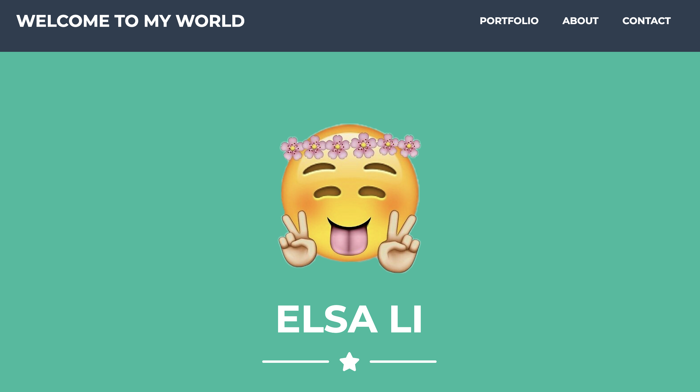
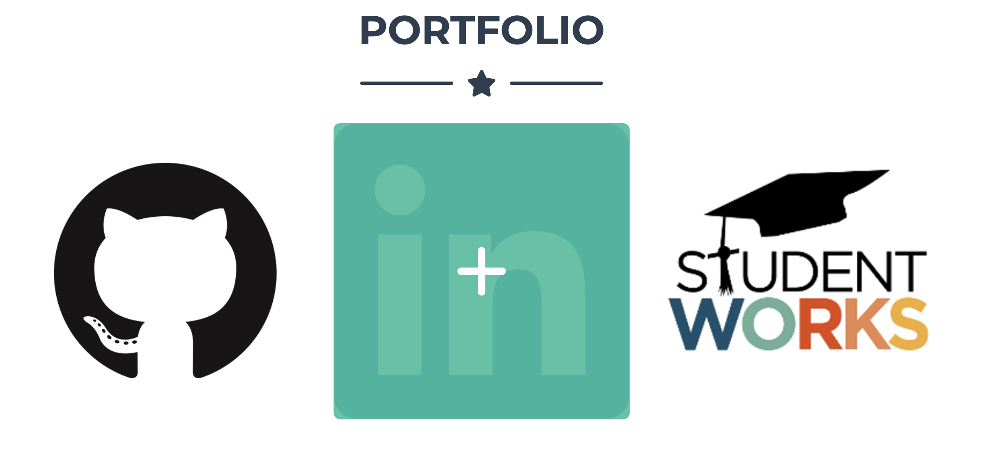
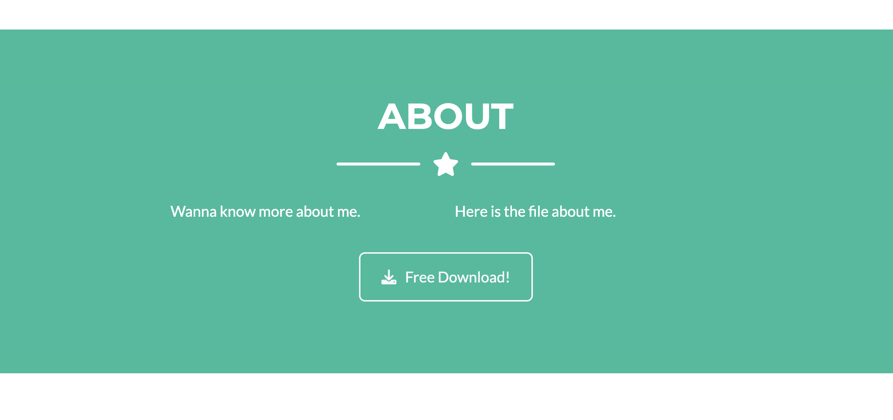
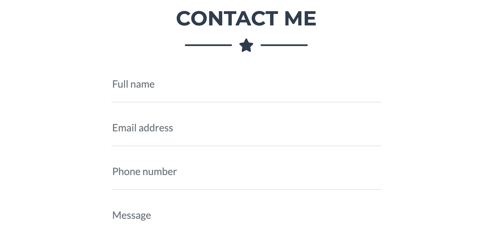

# week8-homework PORTFOLIO
This is the detail for week8-homework PORTFOLIO.

* Create a new repository on my Github account and creat a README.md file.
* Write Javascript code in vs Code.
* Make sure the code meets the requirements.
* Always checking the result in webpage.

* Write the code in vs Code and upload it by gitpush.
* Update the code to the repo.
* Create a webpage link at github in setting

## Link my homework

[Protfolio](https://elsa5152.github.io/week8-homework/)

## GitHub Link

[Link](https://github.com/elsa5152/week8-homework.git)